# Research Memo
## Executive Summary

In this project, I built an N-body simulator with four iterative integrators, Euler, Runge-Kutta 2 and 4, and Leapfrog. I applied standard diagnostics to each section, which included energy components, relative error, and virial ratio over time. The system contains N-bodies with optional Kroupa IMF and Plummer sphere sampling. The system is gravitationally bound using Newtonian gravity and a softening factor. 

Comparing each of the integration methods, Leapfrog did the best at maintaining the energy of the system over time. 

Except for the integration itself, the entire system and its physics are calculated via NumPy vectorization, which shows as an $O(N^2)$ scaling on the number of bodies vs run time plot. 

## Methodology
### Approach

When building a scalable software, it is important to minimize the time complexity of each function. So, all of the forces, sampling functions, and energies are computed with NumPy vectorization. This allows the only time complexity to come from the number of steps, which is a required complexity when doing iterative integration. 

Using and saving larger data structures is also computationally heavy and takes time, so I tried to balance organization and functionality with simplicity in each iteration. Some examples of this are: saving only a specified number of frames instead of every time step, only updating acceleration at each iteration, and updating energy when saving a specific frame, and making shallow copies throughout the integration instead of deep copies or mutilation. 

To help with reproducibility and widening applications, I started the project with a lot of pseudocode and conceptualization. So, each function I built, I vectorized to minimize time complexity, and I allowed for any number of bodies or dimensions.

### Algorithms

The central algorithm within this project is acceleration from Newtonian gravity with a softening parameter, as shown below. 

$$
\vec{a}_i = \sum_{\substack{j=1 \\ j \ne i}}^{N} G\,m_j \frac{\vec{r}_j - \vec{r}_i}{\left(\lvert\vec{r}_j - \vec{r}_i\rvert^2 + \epsilon^2\right)^{3/2}}
$$

Where $\epsilon$ is either given or computed as shown below.

$$\epsilon \approx 0.01 \times R_{\text{cluster}}/N^{1/3}$$

To compute this with N bodies and d dimensions, I used NumPy vectorization, specifically computing with matrix operations. To start, I made a position matrix with each row holding a body and each column holding a dimension. Then, I used pairwise offsets to create a three-dimensional matrix, which holds the position vectors from each body to each other body in the system. With this three-dimensional matrix, I could then multiply the mass of each body by its corresponding applied force vector. To find the radii, I squared the differences and summed over the dimensions. Since the radius between a body and itself is zero, I set the diagonal to infinity to avoid any division by zero errors when computing. Then, I implemented the softening factor $\epsilon$ and applied each of these components to the acceleration equation, creating a three-dimensional matrix of each component of acceleration to and from each body in the system. Finally, I summed each of the accelerations in each component for each body, producing a final two-dimensional matrix describing the acceleration of each body in each dimension with the same shape as the original position matrix. 

Throughout the rest of my computations for energies, sampling functions, or otherwise, I used that same general vectorization technique, with the appropriate variables and operations. 

Kroupa IMF is a piecewise power law as follows:

$$\[
\xi(m) \propto \begin{cases}
    m^{- \alpha _1} & m_{min} \le m < m_b \\
    m^{- \alpha _2} & m_b \le m \le m_{max} \\
    \sin(x) & \text{if } x > 0
\end{cases}
\]$$

with $\alpha _1 = 1.3$, $\alpha _2 = 2.3$, and $m_b = 0.5 \(M_\odot\)$

After computing the probability of a mass falling above or below the break, $m_b = 0.5 \(M_\odot\)$, I generated two sets of random uniform numbers, one set to pick if the mass will fall above or below the break, the other to pick where the mass will fall within its segment. This method is called inverse-transform sampling. 

I used the same general method for the Plummer sphere, which models how mass is enclosed within a radius. After re-centering and converting to Cartesian coordinates, this provided a good sampling of N-body positions. 

To sample initial velocities, made a Gaussian distribution with radius-dependent dispersion, as shown below. 

$$\sigma_{1D}^2(r) = \frac{GM_{total}}{6a} \cdot \left(1 + \frac{r^2}{a^2}\right)^{-1/2}$$

I then drew each velocity component for each body independently from this distribution, creating a Plummer sphere in virial equilibrium. 

### Numerical Methods

To model a system evolving and changing position with time, I integrated the acceleration and velocity over time with iterative integration methods. 

First, I implemented Euler's formula, which is 1st order, as shown below. 

$$\vec{r}_{n+1} = \vec{r}_n + \Delta t \cdot \vec{v}_n$$

$$\vec{v}_{n+1} = \vec{v}_n + \Delta t \cdot \vec{a}( \vec{r}_n)$$

Going up to second order, I implemented Runge-Kutta 2 next, which utilizes the midpoint between steps for the slope instead of the previous slope. 

Then, I implemented Runge-Kutta 4, which is 4th order, cutting that time step in fourths for accurate integration. This is much more computationally heavy, though, as it has to run four computations per step instead of one or two. 

Finally, I implemented the Leapfrog/Verlet symplectic method, which is a 2nd order method that utilizes kick-drift-kick. This means that for each time step, it computes a half-step, a full step, recomputes the acceleration, then computes another half step, which leaves you with a full step and an oscillatory but overall conserved system energy. 

## Results

### Energy Diagnostics

I tested my N-body system over a range of parameters, as shown in the table below. The masses were sampled with Kroupa IMF, and the positions and velocities were sampled with the Plummer Sphere model. 

|   Figure  |   N   |   Total Time (yr)     |   Step Size (yr)  |   Half-Mass Radius (AU)   |
| :-------: | :---: | :-------------------: | :---------------: | :-----------------------: |
|     1     |   10  |         500 yr        |       0.001 yr    |            20 AU          |
|     2     |   20  |         500 yr        |       0.001 yr    |           100 AU          |
|     3     |   50  |         500 yr        |       0.001 yr    |           100 AU          |
|     4     |  100  |         500 yr        |        0.01 yr    |           500 AU          |
|     5     |  500  |         500 yr        |        0.01 yr    |          1000 AU          |
|     6     | 1000  |         500 yr        |        0.01 yr    |          1000 AU          |
|     7     | 2000  |         500 yr        |        0.01 yr    |          1000 AU          |

Figure 1a shows the energy for 10 bodies over 500 years. The Energy Components plot shows the total energy remaining constant, while the kinetic and potential energy oscillate, which is expected for leapfrog. The Relative Energy Errors plot shows how the energy stays very consistent over time, without drift. However, there are some points where it spikes, potentially from two objects passing too close to one another, where this does not model well. The Virial Ratios plot shows that the system is generally bounded, but does go super-virial every so often, most likely from escaping objects. 

Figure 2a shows the energy for 20 bodies over 500 years. The plots all show similar behavior to Figure 1a, as expected, with less extreme spikes as objects escaping have a smaller percent of the overall energy when there are more total bodies. 

Figure 3a shows the energy for 50 bodies over 500 years. The plots all show similar behavior to Figure 1a, as expected.

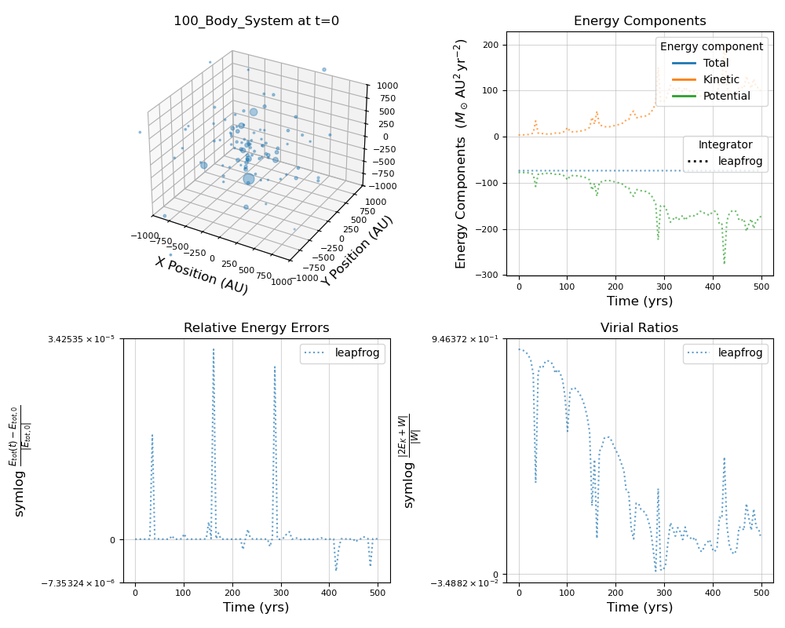

Figure 4a shows the energy for 100 bodies over 500 years. The plots all show similar behavior to Figure 1a, as expected. However, the system started super-virial, which indicates that the initial conditions are overly energetic, but the system cools down over time. 

Figure 5a shows the energy for 500 bodies over 500 years. The plots all show similar behavior to Figure 1a, as expected, with the same initial energy as Figure 4a. 

Figure 6a shows the energy for 1000 bodies over 500 years. The plots all show similar behavior to Figure 1a, as expected, with the same initial energy as Figure 4a. 

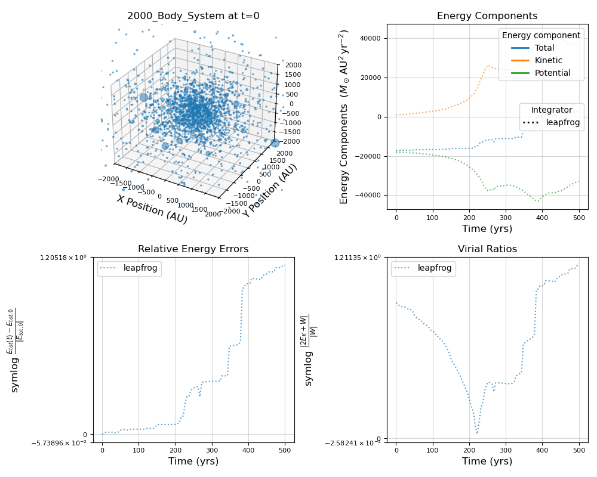

Figure 7a shows the energy for 2000 bodies over 500 years. The plots all show similar behavior to Figure 1a, as expected, with the same initial energy as Figure 4a. 

### Evolution

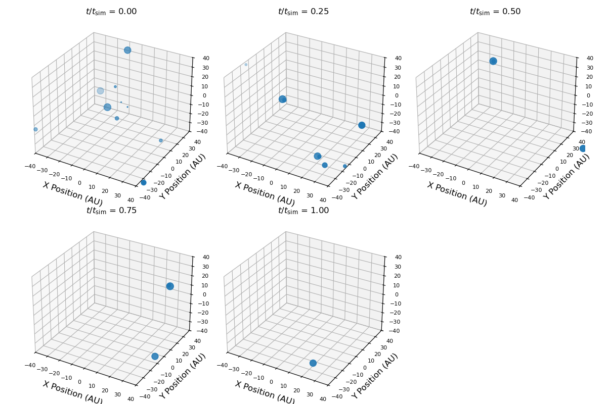

Figure 1b shows the evolution of 10 bodies over 500 years. Many of the bodies escape about halfway through, causing the spikes in the energy plots. 

Figure 2b shows the evolution of 20 bodies over 500 years. The system appears to be much better contained than Figure 1b, which makes sense considering there are more objects and more space. 

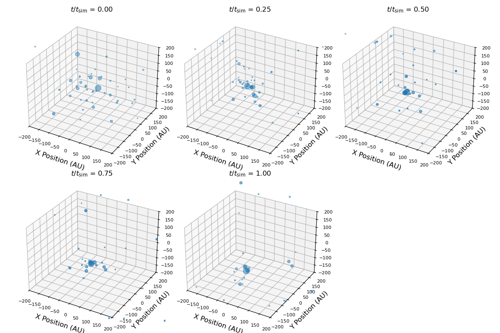

Figure 3b shows the evolution of 50 bodies over 500 years. The system appears to group towards the center, with only a few escaping outwards. 

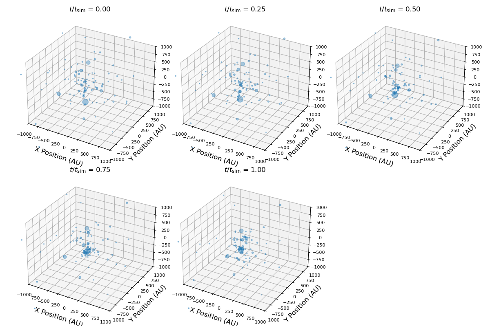

Figure 4b shows the evolution of 100 bodies over 500 years. The system appears to be grouping towards the center with minimum escaping objects. 

Figure 5b shows the evolution of 500 bodies over 500 years. The system also appears to be grouping towards the center. 

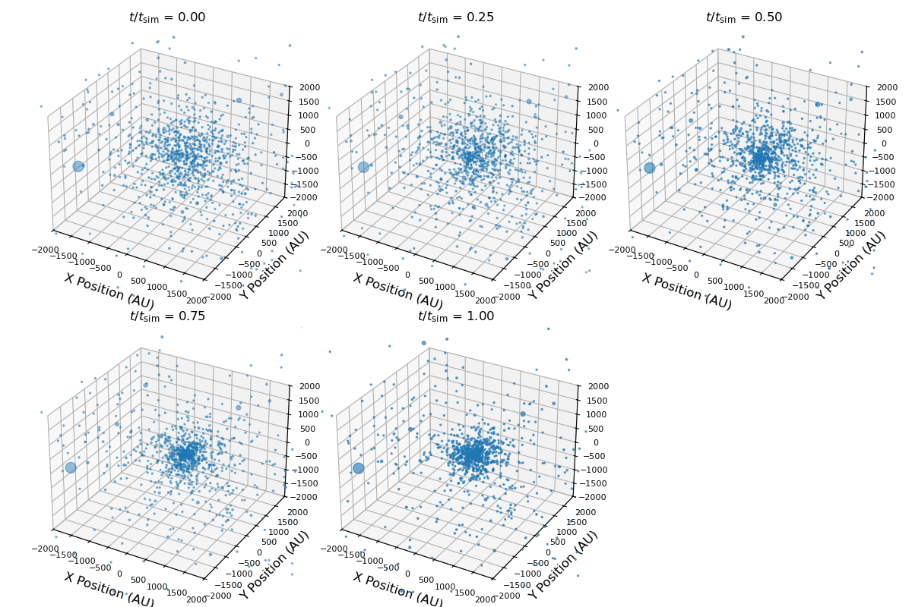

Figure 6b shows the evolution of 1000 bodies over 500 years. The system also appears to be grouping towards the center, but with more escaping objects. 

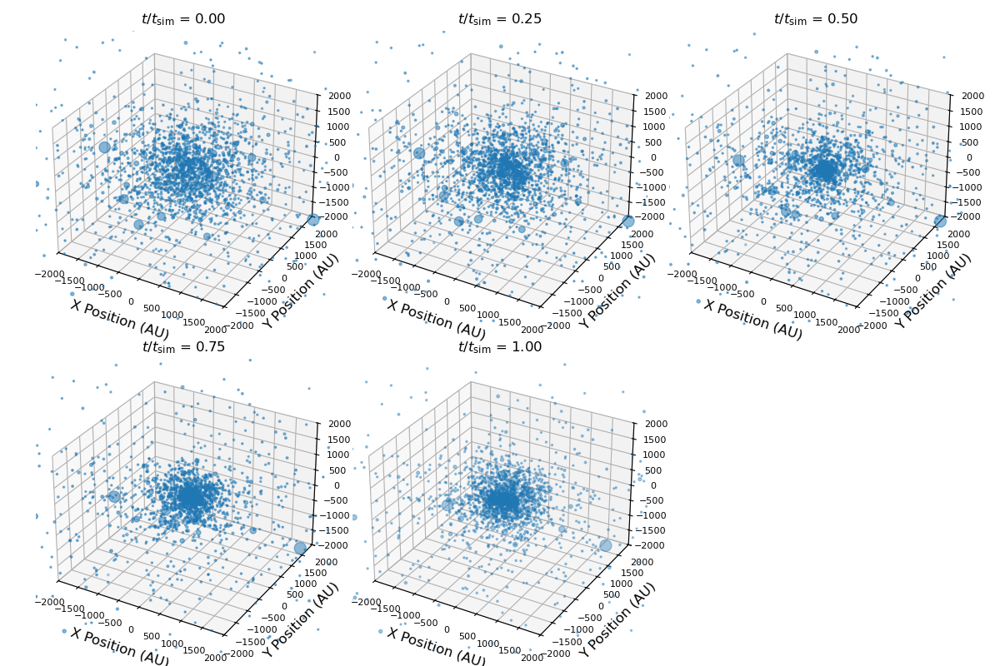

Figure 7b shows the evolution of 2000 bodies over 500 years. The system also appears to be grouping towards the center, with more escaping objects, but it also shows some cool sub-structure forming around the massive stars about halfway through the evolution. 

### Time Analysis

Since I chose to detail my vectorization through pseudo code instead of as loops, I can not note the speed up of loops vs vectorization. However, I ran a time analysis for 10-5000 bodies over 2 years and plotted the results. 

Figure 8 shows an $O(N^2)$ slope, which is exactly as expected. While it may run slowly due to large data structures and sub-optimal practices, the time complexity is $O(N^2)$, and the vectorization can be verified. If there were any hidden loops, the slope would be $O(N^3)$ or more. 

### Showcase

The first showcase I present is a 5,000-body system (a=1000 AU) over 20 years, with a 1.0 yr time step. 

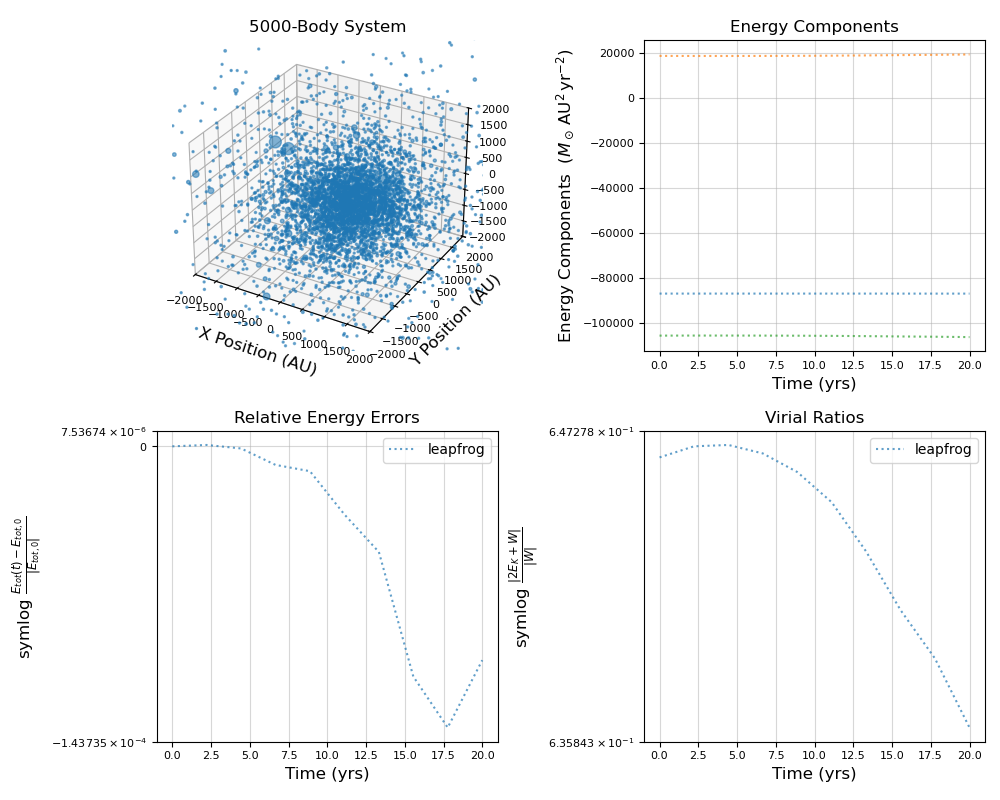

Figure 9a shows the energy of this system over time. The time step is too big, which caused a drift in energy. 

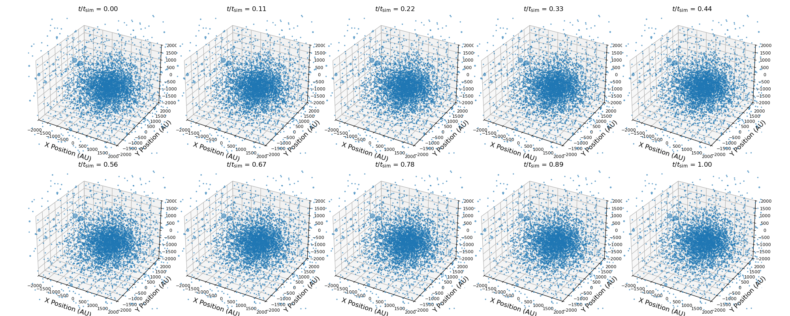

Figure 9b shows the same system in 2-year intervals. 

The next showcase I present is a 10,000-body system (a=1500 AU) over 500 years, with a 1.0 yr time step. 

Figure 10a shows the energy of this system over time. The time step is too big, which caused a drift in energy. 

Figure 10b shows the same system in 50-year intervals. 

## Validation

### Histograms

To validate the Kroupa IMF, I plotted the distribution of masses on a log-log histogram and overlotted the expected Kroupa slopes of $\alpha _1 = 1.3$ and $\alpha _2 = 2.3$. I only included 500-2000 body systems because he larger systems best show the behavior, as expected when sampling from a distribution. 

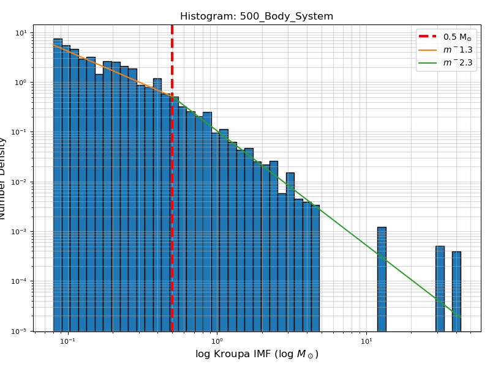

Figure 5c shows the Kroupa IMF distribution for 500 bodies. The red line is the mass break ($m_b = 0.5 \(M_\odot\)$), with slopes of $\alpha _1 = 1.3$ and $\alpha _2 = 2.3$. The slopes of the lines do generally match the slopes of the bins, so the Kroupa IMF function can be validated. 

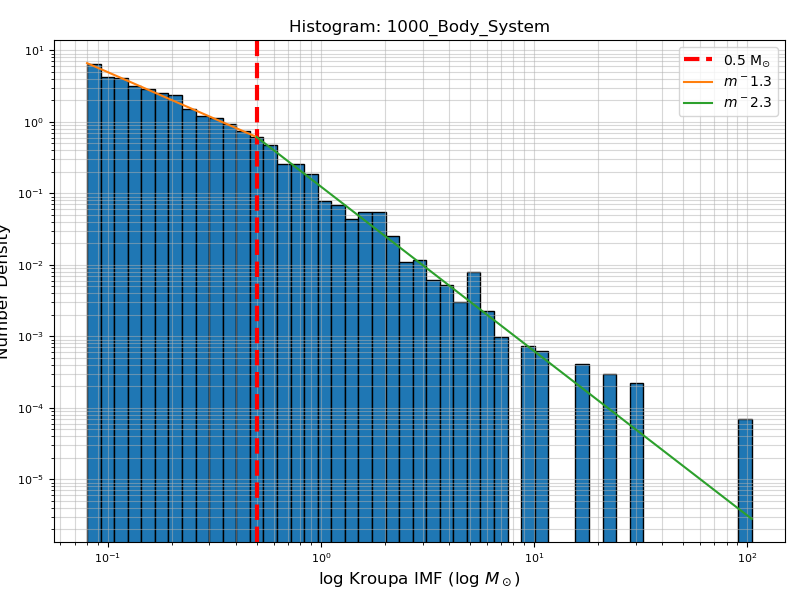

Figure 6c shows the Kroupa IMF distribution for 1000 bodies. The red line is the mass break ($m_b = 0.5 \(M_\odot\)$), with slopes of $\alpha _1 = 1.3$ and $\alpha _2 = 2.3$. The slopes of the lines do generally match the slopes of the bins, so the Kroupa IMF function can be validated. 

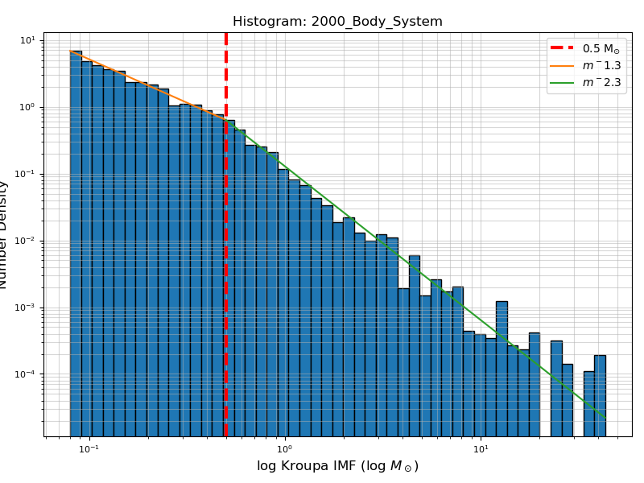

Figure 7c shows the Kroupa IMF distribution for 2000 bodies. The red line is the mass break ($m_b = 0.5 \(M_\odot\)$), with slopes of $\alpha _1 = 1.3$ and $\alpha _2 = 2.3$. The slopes of the lines do generally match the slopes of the bins, so the Kroupa IMF function can be validated. 

### Density Profiles

To validate the Plummer sphere sampling, I plotted the mass density by radius and overplotted the Plummer density function. I only included 500-2000 body systems because he larger systems best show the behavior, as expected when sampling from a distribution. 

Figure 5d shows the radial density profile for 500 bodies. The sampled radial densities almost perfectly match the Plummer density line, with the appropriate scale factor, so the Plummer sphere sampling can be validated.  

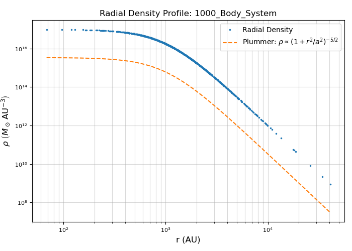

Figure 6d shows the radial density profile for 1000 bodies. The sampled radial densities almost perfectly match the Plummer density line, with the appropriate scale factor, so the Plummer sphere sampling can be validated. 

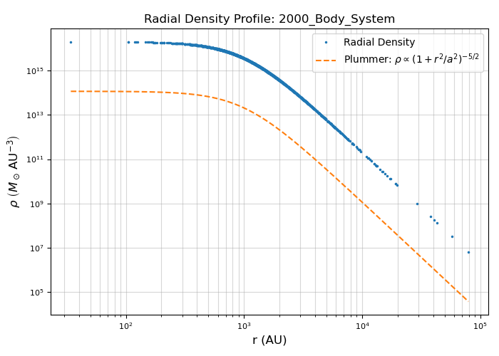

Figure 7d shows the radial density profile for 2000 bodies. The sampled radial densities almost perfectly match the Plummer density line, with the appropriate scale factor, so the Plummer sphere sampling can be validated. 

## Extensions
### Animations

For my extension, I animated the orbits. This was a lot of fun and ads a good visualization to the project. 

Figure 12 shows how fast Euler's method gets off track, even with a short time and small time step. 

Figure 13 shows how RK4 is great on a 10 year, 2-body scale. The Earth perfectly gets back to its initial position each year. 

Figure 14 shows the Earth-Sun-Jupiter system over 24 years, or approximately two jupiter revolutions. Leapfrog does a great job, since Jupiter has a slightly less than 12 year orbit, it should end slightly after its initial position, which it does. 

## Conclusions

In this project, I created a successful N-body simulator that samples initial values with Kroupa IMF and Plummer sphere distributions. I used this system to show the effectiveness of symplectic integrators, such as leapfrog, over standard integration methods. I was able to verify and animate my model with solar system objects, and track the energy of the system over time. I tested the simulator with up to 10,000 objects, which worked well, but some of my structures are not computationally cheap, leading to small slow-downs that add up when already dealing with an $O(N^2)$ computation. I verified all of this information and created meaningful plots to display it. Overall, the project was a success. 

## References

The course website was very helpful. 

## Appendix
### Debugging and Verification

For building, debugging, and verification, I started with a vectorized N-body class, but tested out just a 2D Sun-Earth Orbit with Euler's method. 

Figure A.1 shows one of my earliest plots. I had just finished vectorizing the acceleration and had multiplied the wrong matrix elements together. 

Figure A.2 shows what happens when you leave G in cgs units while the rest of your values are in solar units. 

Once I got Euler's method working, I implemented the remaining three integration methods and plotted the results. I made dozens of plots with different total times and different time steps. The plots shown below best display the desired behavior, but all additional plots can be found in the figures folder. 

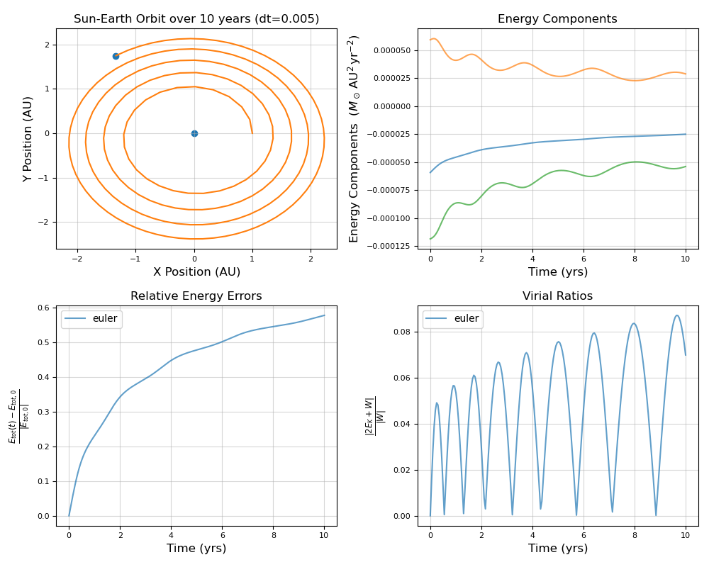

Figure A.3 shows Euler's method only for the Sun-Earth system. Euler's has so much drift that it was skewing the axes when plotted with all 4 methods. 

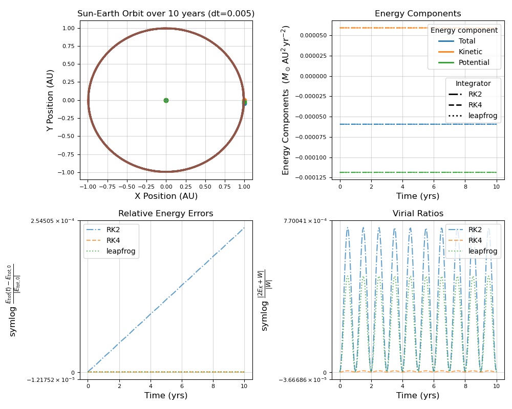

Figure A.4 shows RK2, RK4, and leapfrog for the Sun-Earth system. While all look identical on the orbit, RK2 has a significant drift over just 10 years, while RK4 and leapfrog appear perfect. 

My Sun-Earth system could then be verified by plotting one year and seeing the Earth make one full revolution, with RK4 and leapfrog being significantly better than Euler's and RK2, which was expected. 

Then, I moved to an Earth-Sun-Jupiter system, still in 2D, and with just RK4 and leapfrog. 

Figure A.5 shows how RK4 starts to drift, while leapfrog has an oscillatory relative error, both expected behaviors. 

My Sun-Earth-Jupiter system could then be verified by making an animation of 24 years and watching the Earth make 24 revolutions while Jupiter made 2, with leapfrog being significantly better than RK4, which was expected. 

Then, I moved to a 3D N-body system. The masses and positions were chosen with a random uniform distribution, while the initial velocities were all zero. 

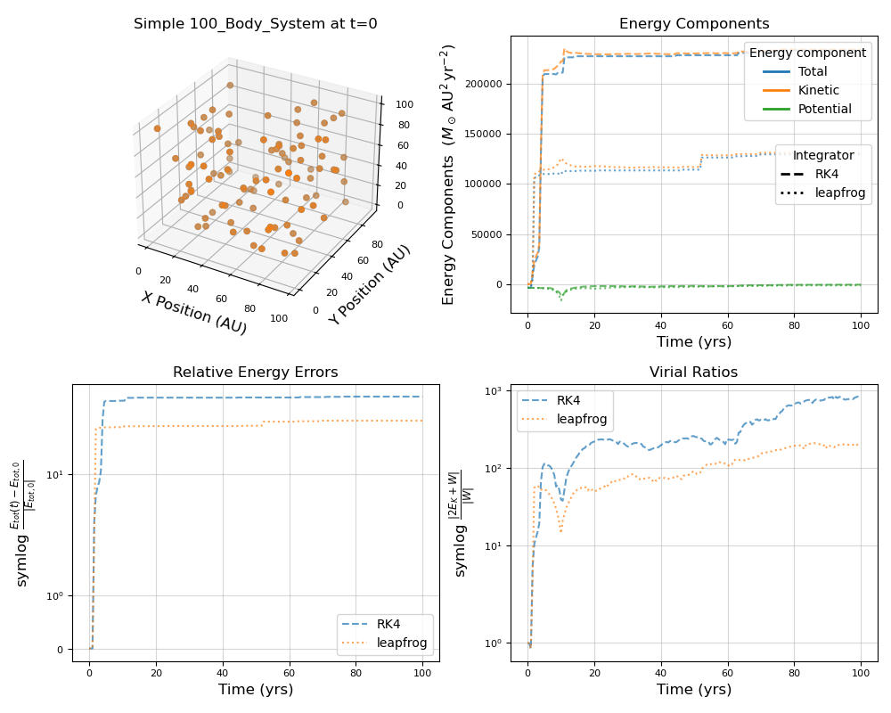

Figure A.6 shows the simple 3D 100-body system over 100 years. This did not include a softening parameter, which is why the energy drifts so much, even for leapfrog. However, all of the values do make sense given that fact. 

Then, I added the softening factor and the Kroupa IMF and Plummer sphere sampling methods, and the results are above. 

Figure A.7 shows my attempt at a 5,000-body showcase. However, this ended up showing me that I forgot to initialize the system to have no net velocity. So, I went back and added it.
